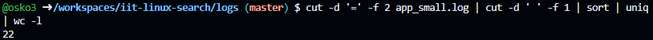
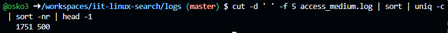
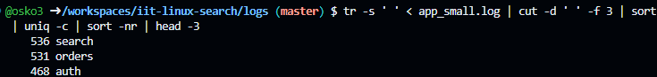
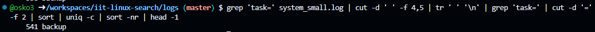

> This is the demonstration how to use Linux commands to process strutured text data.

### 0. How many lines are in fullnames_with_age.txt?

Put screenshot from Codespaces illustrating the result here.
Correct screenshot should contain your github username in the shell, a command and the result.

Example:

**Explanation** Write the explanation why the specific command was used.

Example: wc command is to count data in a given file. -l parameter is for counting lines.

### 1. How many lines in access_small.log have path /login?

Put screenshot from Codespaces illustrating the result here.
Correct screenshot should contain your github username in the shell, a command and the result.

**Explanation** 
- grep searches through the file and selects every line that contains the text /login.
- The output from grep is then sent into wc -l, which counts how many lines were found.
- This gives the total number of log entries where the path /login appears.

---

### 2. How many occurrences of Smith are in fullnames_with_age.txt?

Put screenshot from Codespaces illustrating the result here.
Correct screenshot should contain your github username in the shell, a command and the result.

**Explanation** 
- grep scans the file and finds every line that includes the word Smith.
- The result is piped into wc -l, which counts how many lines contain at least one occurrence of Smith.
- This produces the total number of matching lines.

### 3. How many occurrences of Smith are in fullnames_simple.txt?

Put screenshot from Codespaces illustrating the result here.
Correct screenshot should contain your github username in the shell, a command and the result.

**Explanation** 
- grep scans the file and finds every line that includes the word Smith.
- The result is piped into wc -l, which counts how many lines contain at least one occurrence of Smith.
- This produces the total number of matching lines.

### 4. Which age is most frequent in fullnames_with_age.txt?

Put screenshot from Codespaces illustrating the result here.
Correct screenshot should contain your github username in the shell, a command and the result.

**Explanation** 
- cut -d ' ' -f 3 extracts the third space-separated column from each line, which contains the age.
- sort arranges all ages in order.
- uniq -c counts how many times each age appears.
- sort -nr sorts these counts from highest to lowest.
- head -1 displays the age with the highest frequency.

### 5. Show the 10 most common names (first+last) in fullnames_with_agetxt.

Put screenshot from Codespaces illustrating the result here.
Correct screenshot should contain your github username in the shell, a command and the result.

**Explanation** 
- cut -d ' ' -f 1,2 extracts the first and last name from each line.
- sort arranges all names alphabetically.
- uniq -c counts how many times each name appears.
- sort -nr orders these counts from most to least frequent.
- head -10 displays the ten most common names.

### 6. How many unique users are in app_small.log?

Put screenshot from Codespaces illustrating the result here.
Correct screenshot should contain your github username in the shell, a command and the result.

**Explanation** 
- The first cut -d '=' -f 2 takes the part of each line after the = sign, which contains the user ID.
- The second cut -d ' ' -f 1 removes anything after the user ID so only the ID remains.
- sort arranges all user IDs.
- uniq removes duplicates so each user ID appears only once.
- wc -l counts the number of unique user IDs.

### 7. Which status code appears most often in access_medium.log? 

Put screenshot from Codespaces illustrating the result here.
Correct screenshot should contain your github username in the shell, a command and the result.

**Explanation** 
- cut -d ' ' -f 5 extracts the fifth space-separated field, which holds the status code.
- sort arranges the codes.
- uniq -c counts how many times each unique status code appears.
- sort -nr orders the codes from most frequent to least.
- head -1 shows the single most common status code.

### 8. What is the top 3 most common modules in app_small.log?

Put screenshot from Codespaces illustrating the result here.
Correct screenshot should contain your github username in the shell, a command and the result.

**Explanation** 
- tr -s ' ' compresses repeated spaces into a single space so fields line up correctly.
- cut -d ' ' -f 3 extracts the third column, which contains the module name.
- sort arranges all module names.
- uniq -c counts how many times each module appears.
- sort -nr sorts these counts from highest to lowest.
- head -3 shows the three most common modules.

### 9. Which task appears most often in system_small.log?

Put screenshot from Codespaces illustrating the result here.
Correct screenshot should contain your github username in the shell, a command and the result.

**Explanation** 
- grep 'task-' selects only lines that contain a task identifier.
- cut -d ' ' -f 4,5 extracts the fields where the task values appear.
- tr ' ' '\n' places each token on a separate line so tasks can be isolated.
- grep 'task-' filters out only the tokens that contain task information.
- cut -d '-' -f 2 extracts the task name after the task- prefix.
- sort arranges all task names.
- uniq -c counts how many times each task appears.
- sort -nr orders tasks from most to least common.
- head -1 shows the most frequent task.
